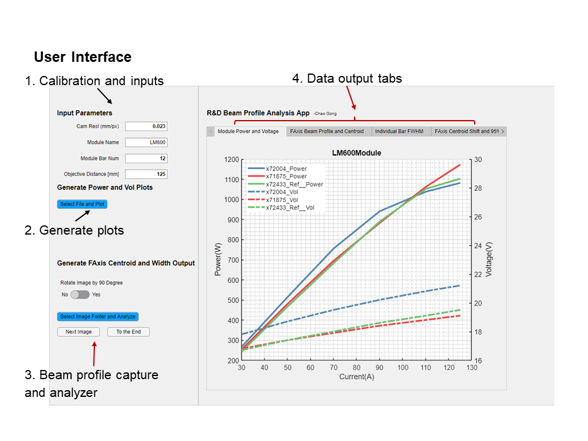
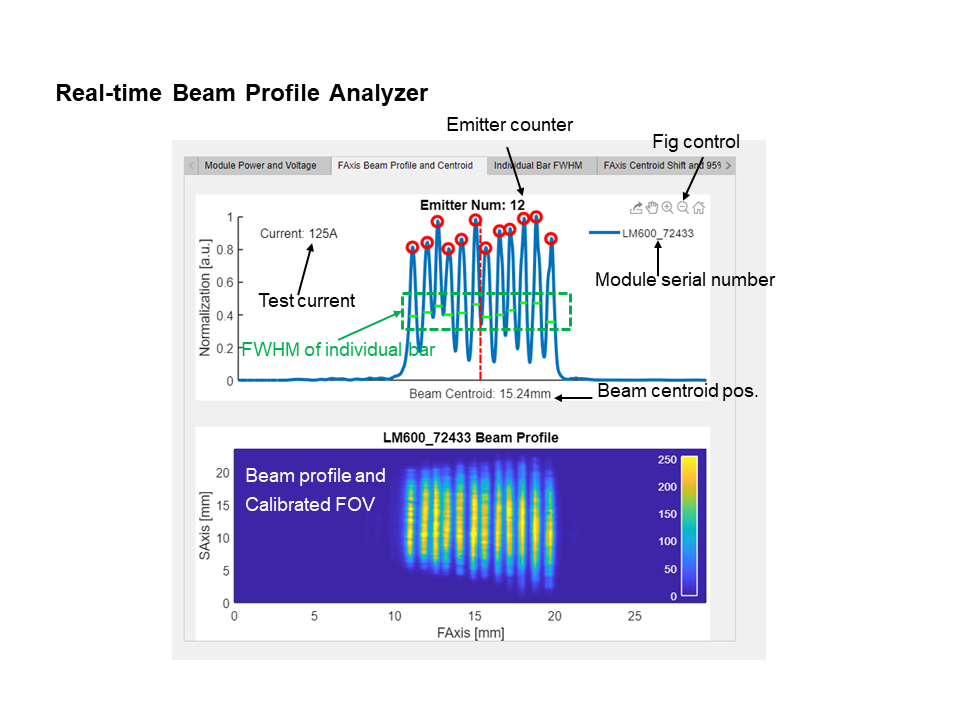
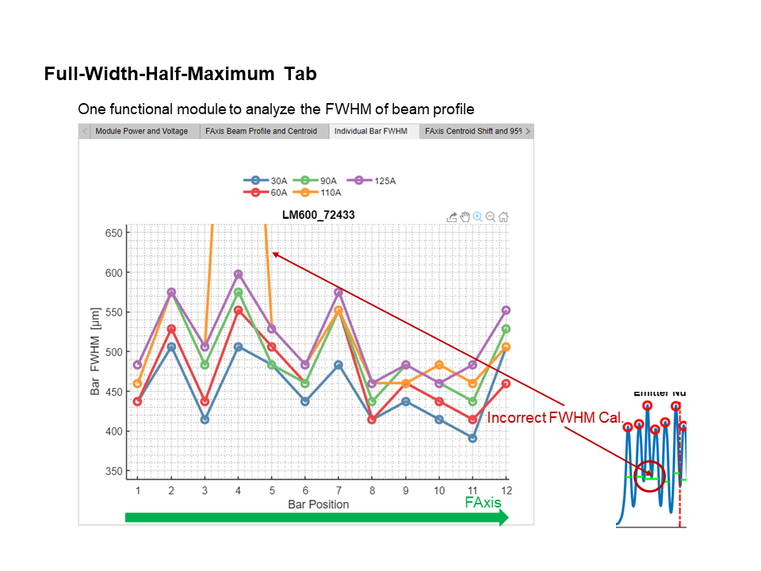
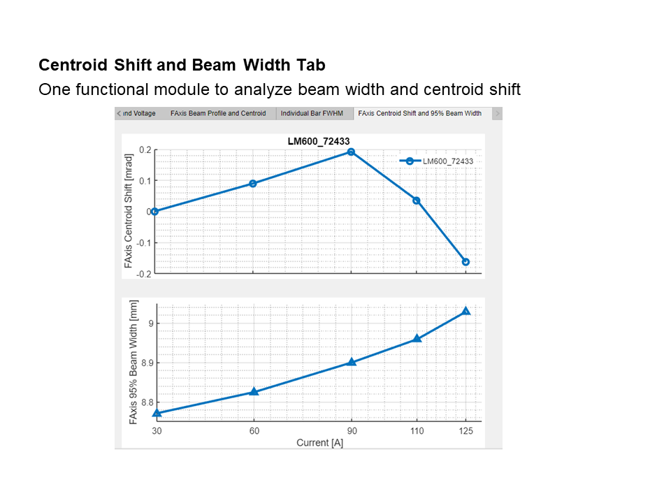

# Real Time Beam Profile Analyzer

## Motivation:

Multiple diode laser microchips mounted on water-channel-cooling heat sink are assembled into the pump module. Current is injected at varied levels. Laser beam is directed out of the aperture of pump module through collimation and refection by the micro-optics inside the module. Beam profile images collected by the CCD are saved on the computer for post-analysis. Problem with this workflow is the real-time calibration and characterization of the pump module is missing. And occasionally, due to the micro-lens installation error, beam rotation and divergence angles which failed the requested criteria can only be revealed afterwards. Then the only way to fix this issue is by breaking and re-installing the micro-optics which lead to an increment of the total cost.  Meanwhile, correlation between beam divergence in horizontal and vertical directions, pointing shift and pumping current is critical for the beam aligning process, which requires real-time feedback. Number of alive emitters in laser chip is also an important indicator to show whether the assembled pump module could be qualified. With all this information required, tracking and analyzing this data in real time and even post-processing it could be challenging and time-consuming, not to mention the extra cost introduced if re-assembling the pump module is required.  

## Solution:
To solve this issue, I have developed the real-time beam profile analyzer (GUI App.), which collects and analyzes the beam divergence, rotation angle, centroid shifting and emitter counting in-situ. Laser characteristic data such as power, voltage, junction temperature and spectrum width are saved in CSV format for post-analysis and plots generating purpose. This app has been used extensively in production and R&D to timely analyze and qualify products. This app is created in Python with NumPy, pandas, SciPy, Matplotlib and seaborn libraries, designed with wxPython and distributed by PyInstaller.

## User Interface and Instructions
1. User Interface:

2. Real-time Beam Profile Analyzer:

3. Full-Width-Half-Maxium Analyzer:

4. Centroid and Pointing Analyzer:
 

